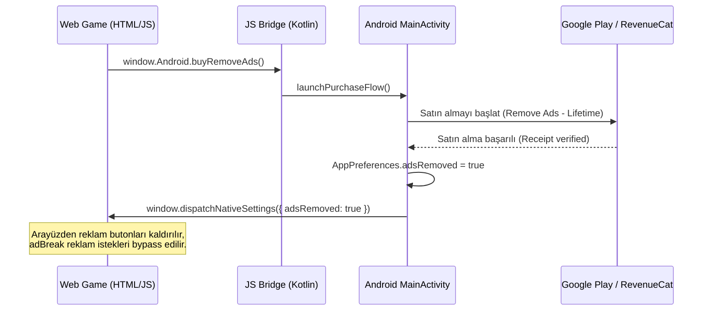

# 2 Player Snake - RevenueCat Reklamsız Sürüm (Premium) Teknik Rehberi

Bu belge, **2 Player Snake** oyununun premium (reklamsız sürüm) altyapısı, kullanılan API anahtarları, entegrasyon ayarları ve native/web köprüsü davranışları için teknik referanstır.

---

## 1. Genel Altyapı ve Konfigürasyon Bilgileri

Premium özelliklerin yönetimi ve Google Play faturalandırma (Google Play Billing) altyapısının doğrulanması için **RevenueCat SDK** kullanılmıştır.

### API Anahtarları ve Hesap Bilgileri

| Parametre | Değer / Yol | Açıklama |
|---|---|---|
| **RevenueCat Android API Key** | `goog_RTZchIHQaIxXoqgGcwvriNeVOGE` | Android uygulaması için RevenueCat API anahtarı |
| **RevenueCat iOS API Key** | `appl_BioGpdwieqcynDcpKXsuKlEeQUQ` | iOS uygulaması için RevenueCat Apple Public API anahtarı |
| **App Store IAP Key ID** | `B6RCC9JZKL` | App Store Connect In-App Purchase Key kimliği (`SubscriptionKey_B6RCC9JZKL.p8`) |
| **App Store Issuer ID** | `087e9e31-e20e-47b1-ac63-5e6384254d8a` | Apple geliştirici hesabı Issuer ID kimliği |
| **Google Play Credentials JSON** | `two-player-snake-1773578271956-30a5906c0f3c.json` | Google Play Developer Console servis hesabı kimlik dosyası |
| **Product ID (Ortak)** | `remove_ads_premium` | Google Play Console ve App Store Connect üzerinde tanımlı tek seferlik Non-Consumable IAP ürün ID'si ($0.99 / Tier 1). |
| **RevenueCat Entitlement ID** | `remove_ads` | Reklamsız sürüm özelliğini kontrol eden yetki (Entitlement) kimliği (Android & iOS ortak). |
| **RevenueCat Offering ID** | `current` / `default` | Aktif sunulan paket grubu (Offering). |
| **RevenueCat Package ID** | `lifetime` / `$rc_lifetime` | Süresiz satın alım paketi. Hem Google Play hem de App Store `remove_ads_premium` ürününe bağlıdır. |

---

## 2. Platformlar Arası Veri Akışı (Data Flow)

Satın alma işlemi native Kotlin katmanında gerçekleşir ve WebView'e (HTML oyuna) aktarılır:



---

## 3. Kod Entegrasyonu Detayları

### A. Kotlin / Android Native Katmanı

#### 1. Bağımlılık (`app/build.gradle.kts`)
```kotlin
dependencies {
    // ...
    implementation("com.revenuecat.purchases:purchases:9.0.1")
}
```

#### 2. SharedPreferences Ayarları (`AppPreferences.kt`)
`adsRemoved` değeri yerel olarak önbelleğe alınır, böylece internet olmadığında da premium durumu hızlıca okunur:
```kotlin
var adsRemoved: Boolean
    get() = prefs.getBoolean(KEY_ADS_REMOVED, false)
    set(value) = prefs.edit().putBoolean(KEY_ADS_REMOVED, value).apply()
```

#### 3. Javascript Köprüsü (`GameJavascriptBridge.kt`)
Web katmanının native kodları tetiklemesini sağlayan arayüz fonksiyonları:
```kotlin
@JavascriptInterface
fun isAdsRemoved(): String {
    if (!isCallAllowed()) return "false"
    return preferences.adsRemoved.toString()
}

@JavascriptInterface
fun buyRemoveAds() {
    if (!isCallAllowed()) return
    onBuyRemoveAds()
}

@JavascriptInterface
fun restorePurchases() {
    if (!isCallAllowed()) return
    onRestorePurchases()
}
```

#### 4. Satın Alma ve Doğrulama Akışı (`MainActivity.kt`)
Uygulama açıldığında veya satın alım yapıldığında `MainActivity` üzerinden RevenueCat API çağrıları yönetilir:
- **Açılışta Durum Kontrolü (`checkPremiumStatus`):**
  `Purchases.sharedInstance.getCustomerInfoWith` kullanılarak kullanıcının `remove_ads` entitlement'ının aktif olup olmadığı kontrol edilir. Durum değiştiyse yerel tercihler güncellenir ve WebView'e bildirilir.
- **Satın Alım Başlatma (`launchPurchaseFlow`):**
  `offerings.current?.lifetime` paketi çekilerek `purchaseWith` fonksiyonu ile Google Play ödeme penceresi açılır. Satın alım başarılı ise `preferences.adsRemoved = true` yapılır.
- **Satın Alımları Geri Yükleme (`launchRestoreFlow`):**
  `restorePurchasesWith` ile kullanıcının eski satın alımları Google Play hesabı üzerinden taranarak geri yüklenir.

---

## 4. Web / HTML5 Oyun Katmanı

### A. Javascript Ayar Dinleyicisi
Android shell tarafından tetiklenen `two-player-snake:native-settings` eventi dinlenerek premium durumu JavaScript değişkenlerine aktarılır:
```javascript
window.addEventListener("two-player-snake:native-settings", function (event) {
    const settings = event.detail;
    if (settings) {
        window.adsRemoved = !!settings.adsRemoved;
        if (window.adsRemoved) {
            // Arayüzdeki "Reklamları Kaldır" butonlarını gizle
            document.querySelectorAll(".remove-ads-btn").forEach(el => el.style.display = 'none');
        }
    }
});
```

### B. Reklam Tetikleyicisi Bypass Mantığı (`android_bridge_bootstrap.js`)
Reklam yönetim fonksiyonunda, premium durumu aktifse geçiş (interstitial) reklamları doğrudan atlanır; ödüllü (rewarded) reklamlar ise **reklam gösterilmeden anında onaylanır**:
```javascript
function __nativeAdBreakShim(o) {
    console.log("Android Shell: adBreak requested", o);
    var req = (o && typeof o === "object") ? o : {};
    
    // PREMIUM KONTROLÜ
    const isPremium = window.TwoPlayerSnakeAppSettings && window.TwoPlayerSnakeAppSettings.adsRemoved;

    if (isPremium) {
        if (req.type === "reward") {
            // Premium Oyuncu: Beklemeden, reklamsız anında canlanma (Revive)!
            console.log("Android Premium: Rewarded ad auto-granted without video.");
            if (req.beforeAd) req.beforeAd();
            if (req.beforeReward) req.beforeReward(function() {});
            if (req.adViewed) req.adViewed();
            if (req.afterAd) req.afterAd();
            if (req.adBreakDone) req.adBreakDone();
            return;
        } else {
            // Geçiş reklamlarını tamamen pas geç
            console.log("Android Premium: Skipping interstitial ad.");
            if (req.adBreakDone) req.adBreakDone();
            return;
        }
    }
    
    // Premium değilse normal reklam akışı çalışır...
}
```

---

## 5. Yayınlama ve Test Adımları

### A. Google Play Console ve RevenueCat Eşleştirmesi
1. `C:\Users\Toygun\Desktop\AI Games\2 Player Snake\Play Store Key\two-player-snake-1773578271956-30a5906c0f3c.json` servis hesabı dosyasının yetkilerinin Google Play Console'da finansal verileri ve finansal işlemleri okumaya izni olduğundan emin olun.
2. Bu JSON dosyasını RevenueCat Panelinde **Settings -> Integrations -> Google Play Store** sekmesine yükleyin.
3. Google Play Console üzerinde **In-App Products** altında `remove_ads_premium` ID'li ürünü oluşturun ve aktifleştirin.

### B. Cihaz Üzerinde Sandbox Test Adımları
1. Google Play Console'da **Dahili Test (Internal Testing)** kullanıcısı olarak tanımlı bir Gmail hesabı ile Android cihaza giriş yapın.
2. Dahili test sürümü (v3.3.1 - versionCode 60) yüklendiğinde, ana menüde 👑 **Remove Ads** butonunun göründüğünü doğrulayın.
3. Butona tıklayarak Google Play Sandbox test penceresiyle (ücretsiz test kartıyla) satın alım gerçekleştirin.
4. Satın alım başarılı olduğunda:
   - "Teşekkürler!" diyalog penceresinin açıldığını,
   - Ana menü ve ayarlardaki 👑 **Remove Ads** butonunun kaybolduğunu,
   - Oyun içi yılan öldüğünde ödüllü canlanma butonunun "Watch Ad to Continue" yerine **"Continue for Free"** olarak değiştiğini ve tıklandığı an beklemeden canlandığını doğrulayın.
5. Uygulamayı arka plandan kapatıp tekrar açtığınızda premium durumunun korunduğunu test edin.
6. İnterneti kapatıp (çevrimdışı modda) uygulamayı açtığınızda local fallback sayfasında da premium durumun algılandığını ve reklam butonlarının gizlendiğini doğrulayın.
