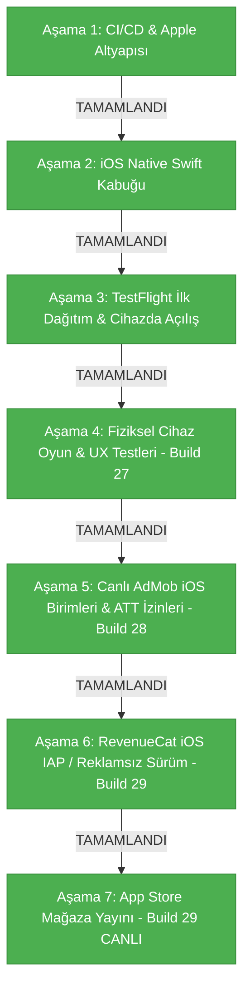

# 2 Player Snake - iOS Sürümü Yapay Zeka Rehberi

Bu belge, `2 Player Snake` projesinin iOS native hibrit uygulama katmanı için teknik referanstır. Masada fiziksel bir Mac bilgisayar olmadan, Windows ortamından bulut CI/CD (GitHub Actions + Fastlane) altyapısıyla geliştirilen ve Apple ekosistemiyle %100 uyumlu çalışan iOS kabuğunun tüm mimari detaylarını ve yol haritasını içerir.

---

## 1. Güncel devir notu — Build 44 (v3.3.7, 2026-09-19)

- Marketing version: `3.3.7`; son native build `44`, HTML runtime referansı `v3.3.7`.
- **Universal Links & WhatsApp Daveti (Doğrudan Uygulama Açma):**
  * `https://2playersnake.com/invite?room=...&mode=...` bağlantısı tıklandığında Safari yerine yerel iPhone uygulaması açılır.
  * Teaser video otomatik atlanır ve doğrudan arkadaşın odasına bağlanılır.
  * `TwoPlayerSnake.entitlements` dosyasına `applinks:2playersnake.com` yetkisi tanımlandı.
  * `Info.plist` içine `twoplayersnake://` custom scheme eklendi.
  * Sunucuda `public_html/.well-known/apple-app-site-association` Apple doğrulama dosyası canlıda aktif (HTTP 200 OK).
  * Web fallback için `public_html/invite/index.html` güncellendi ("UYGULAMADA AÇ" butonu ve app scheme).
  * `SceneDelegate.swift` ve `ViewController.swift` derin bağlantıları karşılayıp `window.joinOnlineRoom` üzerinden maça bağlar.
- **Re-engagement Bildirimleri (iOS - 21 Dil):**
  * `UNUserNotificationCenter` ile Android ile birebir paralel çalışan yerel bildirim altyapısı kuruldu (`NotificationManager.swift`, `NotificationStrings.swift`).
  * 21 farklı dilde 1. Gün (24s), 3. Gün (72s) ve 7. Gün (168s) aralıklarında yerel bildirim planlanır.
  * Oyuncu her oyuna girdiğinde sayaçlar sıfırlanır; 3. açılışta Apple HIG uyumlu izin istenir.
- **HTML Sürümleri (v3.3.7):**
  * Yeni `2 Player Snake Mobile v3.3.7.html` ve `2 Player Snake PC v3.3.7.html` oluşturuldu; `window.joinOnlineRoom` eklendi.
- **UI Alt Panel Düzenlemesi:**
  * iPhone ekranının altında renkli oyuncu stat kutularının alt köşeleri Android ile aynı oval estetiğe (`border-radius: 12px`, `padding-bottom: 0`) kavuşturuldu.
- **Otomatik Testler:**
  * `node --test tests/ios-runtime.test.cjs` 26/26 test ile %100 başarılı geçti.
- **TestFlight CI/CD Dağıtımı:**
  * Tag `ios-v3.3.7-b44` ile GitHub Actions Run #35463663786 üzerinden TestFlight derleme ve dağıtımı başlatıldı.

## 1.1. Önceki App Store Sürümü — Build 42 (v3.3.6, 2026-09-18)
- **🎉 App Store Canlı Yayında (Ready for Distribution - 2026-09-18):**
  * Uygulama **v3.3.6 (Build 42)** gönderildikten sadece 2.5 saat sonra Apple tarafından resmi olarak **ONAYLANDI ve DÜNYA GENELİNDE YAYINA GİRDİ (Ready for Distribution)**!
  * **26 Dilde Eksiksiz Yerelleştirme:** App Store Connect mağaza listelemesi 26 dilde (Türkçe, İspanyolca, Almanca, Fransızca, İtalyanca, Portekizce, Rusça, Felemenkçe, Lehçe, Arapça, Çince, Japonca, Korece, Hintçe, Endonezce, Tayca, Vietnamca, İbranice, İngilizce UK, Çekçe, Danca, Fince, Yunanca, Macarca, İsveççe, İngilizce US) Apple standartlarına uygun emojilerden arındırılmış temiz kurşun işaretli (`•`) şablonla onaylandı.
  * **Resmi App Store URL:** `https://apps.apple.com/app/id6811546748` (Apple ID: `6811546748`, Paket: `com.twoplayersnake.app`)
  * **AdMob Mağaza Eşleştirmesi:** AdMob paneline `6811546748` Apple ID ile bağlandı.
  * **ads.txt & app-ads.txt:** `https://2playersnake.com/ads.txt` ve `/app-ads.txt` kök dizine yüklendi. AdSense tarafından `Hazır` olarak anında algılandı; AdMob app-ads.txt taraması bekleniyor.
- **Apple Game Center Yetki Dosyası (`TwoPlayerSnake.entitlements`):**
  * App Store Connect'teki sarı yetki uyarısı `com.apple.developer.game-center = true` entitlements dosyasının Xcode projesine eklenmesiyle tamamen çözüldü ve onaylandı.
- **Apple Game Center (15 Başarım) & Doğrudan App Store İnceleme:** Build 42 ile `GameCenterManager.swift` üzerinden tam entegre edildi.
- **iPhone (iOS App, Safari & Chrome) Menü ve Demo Yılan 60 FPS Kesin Çözümü (Kullanıcı Doğrulandı):**
  * **Kök Neden:** Canlı 60 FPS `<canvas>` üzerindeki CSS `filter: blur(6px)` filtresinin WebKit Metal kompozitöründe her karede tam ekran doku kopyalaması (texture readback stall) yapması, alt menülerdeki çifte blur (`backdrop-filter`) ve Retina DPR 2.0 (1.4M+ piksel) yükü.
  * **Çözüm (Android Paritesi):**
    1. **DPR 1.35 Sınırı:** iOS mobil cihazları için de Android ile aynı `dpr = 1.35` sınırı getirildi (%54 daha az piksel).
    2. **Orijinal Cyberpunk Blur (6px):** `#canvasWrap.paused-blur > canvas` üzerinde `filter: blur(6px)` korundu, ancak `transform: translateZ(0); will-change: filter, transform;` ile Metal üzerinde izole donanım katmanına alındı.
    3. **Çifte Blur Engellendi:** Alt menülerdeki (`.banner.padded`) `backdrop-filter` kaldırılarak GPU'nun bulanık canvas'ı tekrar bulanıklaştırması önlendi.
    4. **Menü Geçiş Dondurması:** `menuDemoFreezeUntil` iOS cihazları için de aktif edilerek menü butonlarına tıklandığında geçiş animasyonlarının 60 FPS akması sağlandı.
  * **Kullanıcı Onayı:** Kullanıcı tarafından fiziksel iPhone üzerinde hem web (Safari/Chrome) hem canlı App Store uygulaması ile test edildi: *"Kasma geçti süper, tam istediğim gibi oldu."*
- **Otomatik Testler:** `node --test tests/ios-runtime.test.cjs` 21/21 test ile %100 geçti.
- Ayrıntılı uygulama, test, yayın ve rollback kaydı: [iOS_Build_36_Verification.md](iOS_Build_36_Verification.md).
- Kullanıcı isteği: orijinal blur/glass tasarımı korunacak; “efekt kapatarak performans” yaklaşımı uygulanmayacak (bu kurala tam uyuldu).
- Canlı mobil HTML ayrıca web sitesine yüklenmelidir. GitHub push / native paket bunu tek başına yapmaz.
- Canlı `game-mobile/index.html` güncellendiğinde hem web hem de App Store'daki mevcut uygulama (Build 42) anında akıcı hale gelir; yeni build gerekmez.

## 2. Build 36 teknik değişiklikleri

- Bridge'in blur/gölge/animasyon kapatan override'ları kaldırıldı; safe-area/touch düzenleri kaldı.
- iOS'ta closure-local sürüm kontrolü gerçekten durduruldu. Build 35'in `window.*` stub'ları bunu yapmıyordu.
- HTTPS oyun ve offline fallback font/logo/ikonları native paket kaynaklarından alır; Socket.IO istemcisi de paketlendi, offline bağlantı stub'ı korunur.
- iOS AI cache'i yılan başına ayrıldı; engel, grid, mod ve beklenen baş konumuyla doğrulanır. Android cache davranışı değişmedi.
- iOS menü demo freeze'i kaldırıldı; interpolasyon sınırlandı. Kontrollü testte 8 yerine 2 BFS çağrısı ölçüldü; cihaz FPS sonucu değildir.
- `gameReady` ile START; 15 s remote-ready timeout ve 10 s local-ready hata koruması; stable per-build URL ve zorunlu HTTP revalidation. Build 37 ayrıca boş/geçersiz HTML'i reddeder.
- Reklam başlangıç watchdog'ları native 7.5 s / JS 8.5 s; gerçek sunum başlayınca iptal. Gecikmiş/tekrarlanan yanıt koruması ve ödülsüz timeout.
- `[GameReady]` / `[GamePerformance]` özet logları; ayrıca rAF/polling yok, dışarı telemetri yok.
- Test komutları: Windows `node --test tests/ios-runtime.test.cjs`; macOS `bash tools/test-ios-runtime.sh`.
- CI Apple sertifikasını otomatik iptal etmez. Cache/P12 yok ve kota doluysa kullanıcıdan doğru sertifika gerekir.

### Kanıtların ayrımı

Offline'ın akıcı olduğu kullanıcı gözlemidir. Eski bridge CSS'i iki kaynakta da çalıştığından
“offline kesin orijinal blur kullanıyordu” varsayımı kodla doğrulanmış değildi.
Ortak AI cache'i hatalı paylaşım içeriyordu, ancak iki HTML'de de bulunduğundan tek başına
online/offline farkının ölçülmüş kök nedeni sayılamaz. Build 36 cihaz testi bekleniyor.

---

## 3. GitHub Push, Tag ve TestFlight CI/CD Dağıtım Prosedürü (Codex / AI Kılavuzu)

Fiziksel Mac olmadan Windows ortamından TestFlight'a yeni build göndermek için izlenen standart prosedür aşağıdadır:

### Adım 1: Sürüm Numaralarını Eşzamanlı Yükseltme (Build Number)
Yeni bir build çıkarken (örneğin Build 36 için) şu 4 dosyada yapı numarası mutlaka birlikte güncellenmelidir:
1. **`Ana Dosya/iOS/TwoPlayerSnake/Info.plist`**:
   * `<key>CFBundleVersion</key>` altındaki değer: `35` ➔ `36`
2. **`Ana Dosya/iOS/TwoPlayerSnake.xcodeproj/project.pbxproj`**:
   * Dosya içinde tam **4 adet** `CURRENT_PROJECT_VERSION` bulunur (Debug ve Release şemaları, satır ~337, ~394, ~405, ~429).
   * **Dördü birden** `35` ➔ `36` olarak değiştirilmelidir!
3. **`Ana Dosya/iOS/TwoPlayerSnake/ViewController.swift`**:
   * `queryItems` içindeki `app_code` fallback değeri (satır ~397): `"35"` ➔ `"36"`
4. **Dokümantasyon:**
   * `MD Files/Release_Notes.md` en üstüne yeni build başlığı ve notları eklenir.
   * `MD Files/AI_Guide_iOS.md` güncel durum güncellenir.

### Adım 2: Git Commit, Tag ve Push Kuralları (PowerShell Uyarısı!)
* **ÖNEMLİ KURAL (PowerShell):** Windows PowerShell ortamında komutları zincirlemek için `&&` **KULLANILMAZ**, yerine `;` kullanılır.
* **Tag Formatı:** GitHub Actions workflow'u yalnızca `ios-v3.3.5-b*` etiketlerini dinler!
```powershell
# 1. Değişiklikleri stage et
git add "Ana Dosya/iOS/TwoPlayerSnake.xcodeproj/project.pbxproj" "Ana Dosya/iOS/TwoPlayerSnake/Info.plist" "Ana Dosya/iOS/TwoPlayerSnake/ViewController.swift" "Ana Dosya/iOS/TwoPlayerSnake/Bridge/ios_bridge_bootstrap.js" "MD Files/AI_Guide_iOS.md" "MD Files/Release_Notes.md"

# 2. Commit at
git commit -m "feat(ios): Build 36 - <açıklama> (ios-v3.3.5-b36)"

# 3. Tag oluştur (workflow'u tetikleyen asıl tetikleyicidir)
git tag -a ios-v3.3.5-b36 -m "TestFlight Release v3.3.5 Build 36"

# 4. Hem main branch'i hem tag'i push et
git push origin main ; git push origin ios-v3.3.5-b36
```

### Adım 3: GitHub Actions Bulut Derlemesi & TestFlight Dağıtımı
Tag push edildiğinde `.github/workflows/ios-testflight.yml` otomatik olarak çalışmaya başlar:
* **Ortam:** `macos-latest` (macOS 26 Sonoma / Xcode 26+)
* **İşlemler:** CocoaPods bağımlılıklarını kurar, GitHub Secret'taki App Store Distribution sertifikasını keychain'e ekler, Xcode ile `.ipa` arşivler ve Fastlane ile doğrudan Apple TestFlight API'ye yükler.
* **Süre:** Ortalama 4-5 dakika sürer.

### Adım 4: Build Durumunu Windows'tan İzleme (Token & Python)
* Sistemde `gh` (GitHub CLI) **yüklü değildir**.
* CI/CD adımlarını izlemek için sistemdeki Git kimlik yöneticisinden token çekip GitHub REST API'yi sorgulayan Python kullanılır:
```python
import subprocess, urllib.request, json

# Git token'ı otomatik al
proc = subprocess.run(['git', 'credential', 'fill'], input='protocol=https\nhost=github.com\n', text=True, capture_output=True)
token = [line.split('=', 1)[1] for line in proc.stdout.splitlines() if line.startswith('password=')][0]
headers = {'Authorization': f'Bearer {token}', 'Accept': 'application/vnd.github+json', 'User-Agent': 'Python'}

# En son workflow run'larını listele
req = urllib.request.Request('https://api.github.com/repos/toygun1725/2-player-snake/actions/runs?per_page=3', headers=headers)
with urllib.request.urlopen(req) as resp:
    runs = json.loads(resp.read().decode('utf-8'))['workflow_runs']
    for r in runs:
        print(f"Run #{r['run_number']}: ID={r['id']}, Status={r['status']}, Conclusion={r['conclusion']}")
```

---

## 3. Build 35 Hazırlık Notları (TestFlight)

Bu çalışma, App Store incelemesindeki Build 29'u kesinlikle değiştirmez. Yeni TestFlight paketi için yapı numarası `35` (`ios-v3.3.5-b35`) olarak hazırlanmıştır:

1. **Arka Plan Sürüm Kontrolü (`fetch` Polling) Devre Dışı Bırakıldı:** `ios_bridge_bootstrap.js` içinde `window.checkForFreshVersion` ve `window.scheduleVersionCheck` no-op yapıldı. 700KB HTML'in arka planda taranması ve Garbage Collection (GC) takılmaları engellendi.
2. **Dış Font Ağ Bloklaması Çözüldü:** `font-display: optional !important` CSS enjeksiyonu ile Google Fonts ve FontAwesome yüklemelerinin açılıştaki 15s kilitlenmesi çözüldü.
3. **HTTP Önbellek & Ads Stubbing:** `ViewController.swift` URLRequest önbellek politikası `.returnCacheDataElseLoad` yapıldı. `adsbygoogle` stub'lanarak ağ yoklamaları sonlandırıldı.


---

## 2. Mimari ve Bileşenler

iOS projesi, web oyun koduna (`Ana Dosya/Mobile/index.html`) dokunmadan çalışan ve Android kabuğundaki (`Ana Dosya/Android/`) tüm yetenekleri iOS donanımıyla birebir eşleyen bir Swift 5 mimarisine sahiptir:

```
Ana Dosya/iOS/
├── Podfile                            # CocoaPods bağımlılıkları (Google-Mobile-Ads-SDK)
├── TwoPlayerSnake.xcodeproj/          # Xcode Projesi ve Paylaşılan Şema
│   └── xcshareddata/xcschemes/TwoPlayerSnake.xcscheme
├── TwoPlayerSnake/
│   ├── AppDelegate.swift              # Uygulama yaşam döngüsü & Audio Session
│   ├── SceneDelegate.swift            # Pencere ve UI sahne yöneticisi
│   ├── ViewController.swift           # WKWebView, Safe-Area CSS, Splash, Offline & ATT Tetikleyici
│   ├── GameScriptMessageHandler.swift # Web <-> Swift köprü mesaj işleyicisi (adBreak)
│   ├── HapticManager.swift            # Apple Taptic Engine (UIImpactFeedbackGenerator & AudioServices)
│   ├── NetworkMonitor.swift           # NWPathMonitor ile canlı internet bağlantı takibi
│   ├── AdManager.swift                # Google AdMob SDK (Interstitial & Rewarded) & Apple ATT
│   ├── ios_bridge_bootstrap.js        # Zero-change JS köprü & 8.5s Watchdog Emniyet Simülatörü
│   ├── Info.plist                     # GADApplicationIdentifier, SKAdNetwork listesi, ATT izni
│   ├── Assets.xcassets/               # 1024x1024 App Store ikonu & renk paletleri
│   └── Base.lproj/
│       └── LaunchScreen.storyboard    # Cyberpunk saf siyah açılış ekranı
├── fastlane/
│   ├── Fastfile                       # Kendi kendini onaran CI/CD derleme & CocoaPods workspace hattı
│   └── Appfile                        # Bundle ID & Team ID konfigürasyonu
└── Gemfile                            # Fastlane bağımlılıkları
```

### Kritik Özellikler:
1. **Google Mobile Ads & ATT Entegrasyonu (`AdManager.swift` + `ViewController.swift`):**
   * Kullanıcı START butonuna basıp ana menüye indiğinde Apple'ın resmi ATT (*App Tracking Transparency*) izin diyaloğu tetiklenir.
   * `ca-app-pub-4114535776207741~3769407896` App ID'si ile Google Mobile Ads SDK başlatılır.
   * Geçiş (`6012427858`) ve Ödüllü (`7193260548`) reklamlar önden yüklenir (Preload).
   * 9 saniyelik native ve 8.5 saniyelik JS çift katmanlı Watchdog Timer sayesinde internet kopsa veya reklam gelmese bile oyun asla kilitlenmez.
2. **Sıfır Değişiklikli JS Köprüsü (`ios_bridge_bootstrap.js` + `GameScriptMessageHandler.swift`):**
   Web oyunundaki `window.Android` çağrılarını şeffaf bir şekilde yakalar ve `window.webkit.messageHandlers.iOS.postMessage(...)` üzerinden Swift'e aktarır. Böylece Android, Web ve PC sürümlerinde hiçbir kod değişikliği gerekmez.
3. **Apple Taptic Engine (`HapticManager.swift`):**
   * Normal yem yeme: Donanımsal Peek haptic (`AudioServicesPlaySystemSound(1519)`) ve `.medium` darbe geri bildirimi.
   * Özel / yıldız yem: Orta dokunsal geri bildirim (`.medium`).
   * Duvara / kuyruğa çarpma: Güçlü dokunsal geri bildirim (`.heavy`).
   * Oyun sonu: Hata bildirimi titreşimi (`UINotificationFeedbackGenerator.error`).
4. **Ekran ve Çentik Uyumu (Dynamic Island / Safe-Area):**
   `ViewController.swift`, cihazın çentik ve alt ana ekran çubuğu boşluklarını canlı olarak hesaplayarak web katmanına CSS değişkeni olarak enjekte eder (`--safe-area-top`, `--safe-area-bottom`).
5. **Kesintisiz Ağ İzleme ve Native Fallback:**
   `NetworkMonitor.swift`, `NWPathMonitor` kullanarak internet kopmalarını anında algılar. Sayfa yüklenemezse web beyaz ekranı yerine native cyberpunk temalı bir "Tekrar Dene" butonu gösterir.
6. **Kendi Kendini Onaran CI/CD Hattı (`Fastfile`):**
   * Apple Developer portalındaki 2 dağıtım sertifikası sınırını aşmak için yetim kalmış eski sertifikaları Spaceship API ile temizler.
   * `actions/cache@v4` ile `.p12` sertifikasını ve CocoaPods önbelleğini yönetir.
   * `TwoPlayerSnake.xcworkspace` üzerinden CocoaPods derlemesini otomatik yürütür.

---

## 3. Aşama Durumu (Mevcut Durum ve Kalan Adımlar)

### 📍 2. Şu An Hangi Aşamadadayız? (Yol Haritası Tablosu)

| Aşama | Başlık | Durum |
| :--- | :--- | :--- |
| **Aşama 1** | Bulut CI/CD & Apple Geliştirici Altyapısı | ✅ **Tamamlandı** |
| **Aşama 2** | iOS Native Swift Kabuğu & JS Köprü Mimarisi | ✅ **Tamamlandı** |
| **Aşama 3** | TestFlight İlk Dağıtım & Cihaza İndirme | ✅ **Tamamlandı & Doğrulandı** |
| **Aşama 4** | Fiziksel iPhone Üzerinde Oynanış & UX Testleri | ✅ **Tamamlandı (Build 27)** |
| **Aşama 5** | Canlı AdMob iOS Birimleri & ATT İzin Akışı | ✅ **Tamamlandı (Build 28)** |
| **Aşama 6** | **RevenueCat iOS IAP (Reklamsız Sürüm Satın Alma)** | ✅ **Tamamlandı (Build 29)** |
| **Aşama 7** | App Store Mağaza Yayını & İnceleme Gönderimi | ✅ **Tamamlandı & CANLI YAYINDA (Build 29)** |

---



---

### ✅ Tamamlanan Aşamalar Özeti:

#### Aşama 1: Bulut CI/CD & Apple Geliştirici Altyapısı (TAMAMLANDI)
* Apple Developer hesabı doğrulandı (`GUFQF359Q7`).
* App Store Connect API Anahtarı (`JA97H3PRT7`) ve Issuer ID yapılandırıldı.
* GitHub Secrets repo bazında bağlandı.

#### Aşama 2: iOS Native Swift Kabuğu & JS Köprü Mimarisi (TAMAMLANDI)
* Swift 5 + WKWebView native kabuk projesi oluşturuldu.
* Taptic Engine titreşim motoru, Dynamic Island safe-area enjeksiyonu, native açılış ekranı ve çevrimdışı hata yönetimi kodlandı.
* Android ve web kodunu bozmayan `ios_bridge_bootstrap.js` yazıldı.

#### Aşama 3: TestFlight İlk Dağıtım & Cihaza İndirme (TAMAMLANDI & DOĞRULANDI)
* İlk paket App Store Connect'e yüklendi, dahili test grubuna atandı ve fiziksel iPhone üzerinde indirilip açılışı başarıyla doğrulandı.

#### Aşama 4: Fiziksel iPhone Üzerinde Oynanış & UX Testleri (TAMAMLANDI - Build 27)
* Sürüm numarası Android ve Web ile eşitlenerek `3.3.5` yapıldı.
* Reklam deadlock kilitlenmeleri çözüldü.
* DOM MutationObserver ile maç içi güvenli Peek Haptic titreşimi sağlandı.
* Klavye sonrası ekran kayması ve pause menüsü ana ekran dönüşü düzeltildi.
* Kenardan kenara (edge-to-edge) cyberpunk panel tasarımı oturtuldu.

---

### ✅ Aşama 7: App Store Mağaza Yayını & İnceleme (BAŞARIYLA TAMAMLANDI - CANLI YAYINDA - v3.3.5 / Build 29)
* **Aşama 5 (Canlı AdMob & ATT İzin Akışı):** TAMAMLANDI (Build 28 & 29).
* **Aşama 6 (RevenueCat IAP - Remove Ads Lifetime):** TAMAMLANDI. Non-consumable IAP oluşturuldu, RevenueCat bağlandı ve mağaza paketine dahil edildi.
* **Aşama 7 (App Store Connect Yayını):**
  * iPhone 6.5" ve iPad 13" ekran görüntüleri (1284x2778 ve 2048x2732, RGB) yüklendi.
  * Meta veriler (Açıklama, Anahtar Kelimeler, Destek & Pazarlama URL'leri, Yaş Sınırı 4+, Gizlilik Beyanı) eksiksiz tamamlandı.
  * Uygulama (Build 29) ve In-App Purchase (`remove_ads_premium`) başarıyla onaylandı ve **2026-09-17 itibarıyla Apple App Store'da dünya genelinde CANLI YAYINA (Ready for Sale)** girdi!

---

### 🏆 PROJE DURUMU:
Tüm aşamalar (Aşama 1'den Aşama 7'ye kadar) %100 başarıyla tamamlanmıştır. Uygulama Apple App Store'da resmi olarak yayındadır (v3.3.5 / Build 29). Sonraki güncellemeler ve iyileştirmeler TestFlight hattı (Build 30–37+) üzerinden yürütülmektedir.

---

## 🤖 AI AGENT STANDART OPERASYON PROSEDÜRÜ (SOP): YENİ BUILD VE TESTFLIGHT DAĞITIMI

Gelecekte bu projeyi devralacak veya yeni bir güncelleme / build çıkaracak herhangi bir AI Agent (veya geliştirici) için adım adım uygulanabilir kılavuz:

### 1. Mevcut Sürüm ve Numaralandırma Durumu
* **App Store Canlıdaki Sürüm:** `3.3.5 (Build 29)` — Dünya genelinde yayında.
* **Son TestFlight Derlemesi:** `3.3.5 (Build 37)` (`ios-v3.3.5-b37` - Başarıyla yüklendi)
* **Bir Sonraki Build Numarası:** `38` (Build numarası Apple kuralları gereği her zaman monotonik olarak artmalıdır: 38, 39, 40...).

---

### 2. Yeni Bir Build Oluşturma ve Dağıtma Adımları

#### Adım 1: Kod veya Ayar Değişiklikleri (Gerekiyorsa)
* Native iOS kodları: [`Ana Dosya/iOS/TwoPlayerSnake/`](file:///d:/%233%20Vibecoding/AI%20Games/2%20Player%20Snake/Ana%20Dosya/iOS/TwoPlayerSnake)
* JS Köprüsü: `Ana Dosya/iOS/TwoPlayerSnake/Resources/ios_bridge_bootstrap.js`
* *Kural:* Android (`Ana Dosya/Android`) veya PC/Web ana kodlarına dokunulmaz; platform izolasyonu korunur.

#### Adım 2: Xcode Projesinde Sürüm / Build Numarasını Güncelleme
[`Ana Dosya/iOS/TwoPlayerSnake.xcodeproj/project.pbxproj`](file:///d:/%233%20Vibecoding/AI%20Games/2%20Player%20Snake/Ana%20Dosya/iOS/TwoPlayerSnake.xcodeproj/project.pbxproj) dosyasında:
> ⛔ **KESİN VE DEĞİŞMEZ KURAL:** Kullanıcı bizzat ve açıkça *"v3.3.6 yap"* veya *"yeni mağaza versiyonuna geç"* demediği sürece `MARKETING_VERSION` ASLA değiştirilmez (`3.3.5` olarak sabit tutulur). Hiçbir AI agent veya geliştirici bu numarayı kendi inisiyatifiyle artıramaz.
* `CURRENT_PROJECT_VERSION`: Yalnızca build numarası bir artırılır (Örn: `29` -> `30`).
* `MARKETING_VERSION`: Sabit olarak `3.3.5` kalır.

#### Adım 3: GitHub'a Push ve Otomatik Bulut Derlemesini Tetikleme
Projede Mac bilgisayara gerek kalmadan derleme yapan GitHub Actions CI/CD hattı hazırdır. Aşağıdaki yöntemlerden **biri** uygulanır:

* **Seçenek A — Git Tag ile Otomatik Tetikleme (Önerilen):**
  ```bash
  git add .
  git commit -m "feat(ios): v3.3.5 build 30 release"
  git push origin main
  git tag ios-v3.3.5-b30
  git push origin ios-v3.3.5-b30
  ```
  *(Etiket `ios-v*` formatında push edildiği an GitHub Actions otomatik olarak `macos-latest` üzerinde Xcode derlemesini başlatır, dağıtım sertifikasını çözer ve üretilen `.ipa` paketini doğrudan TestFlight / App Store Connect'e yükler).*

* **Seçenek B — GitHub CLI (`gh`) ile Tetikleme:**
  ```bash
  gh workflow run ios-testflight.yml -f build_number=30 -f version_number=3.3.5
  ```

* **Seçenek C — GitHub Web Arayüzünden:**
  GitHub Reposu > **Actions** > **iOS Build & TestFlight Deployment** > **Run workflow** > `build_number: 30` yazıp butona tıklanır.

---

### 3. Otomasyon Arkasındaki Hazır Altyapı Bileşenleri
* **GitHub Actions Workflow:** [`.github/workflows/ios-testflight.yml`](file:///d:/%233%20Vibecoding/AI%20Games/2%20Player%20Snake/.github/workflows/ios-testflight.yml)
* **Fastlane Lane (`beta`):** [`Ana Dosya/iOS/fastlane/Fastfile`](file:///d:/%233%20Vibecoding/AI%20Games/2%20Player%20Snake/Ana%20Dosya/iOS/fastlane/Fastfile)
* **GitHub Repository Secrets (Önceden Tanımlı):**
  * `APP_STORE_CONNECT_KEY_ID`: `JA97H3PRT7`
  * `APP_STORE_CONNECT_ISSUER_ID`: `087e9e31-e20e-47b1-ac63-5e6384254d8a`
  * `APP_STORE_CONNECT_PRIVATE_KEY`: App Store Connect API .p8 anahtarı.
  * `APPLE_TEAM_ID`: `GUFQF359Q7`
* **Sertifika Kendi Kendini Onarma (Self-Healing):** Fastlane, geçici GitHub runner üzerinde Apple Developer sertifika kotasını Spaceship API ile yönetir ve gerekirse önbellekten (`actions/cache@v4`) geri yükler.
