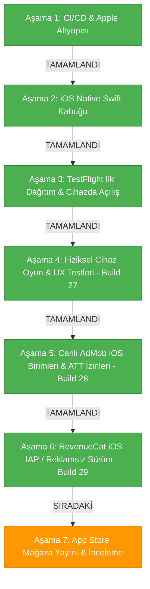

# 2 Player Snake - iOS Sürümü Yapay Zeka Rehberi

Bu belge, `2 Player Snake` projesinin iOS native hibrit uygulama katmanı için teknik referanstır. Masada fiziksel bir Mac bilgisayar olmadan, Windows ortamından bulut CI/CD (GitHub Actions + Fastlane) altyapısıyla geliştirilen ve Apple ekosistemiyle %100 uyumlu çalışan iOS kabuğunun tüm mimari detaylarını ve yol haritasını içerir.

---

## 1. Referans Durum

* **iOS Shell Kaynağı:** `d:\#3 Vibecoding\AI Games\2 Player Snake\Ana Dosya\iOS`
* **Bundle Identifier:** `com.twoplayersnake.app`
* **Apple Team ID:** `GUFQF359Q7` (Toygun ÇETİN)
* **Güncel Sürüm (Marketing Version):** `3.3.5`
* **Güncel Yapı Numarası (Build Number):** `32` (`ios-v3.3.5-b32`)
* **Derleme Ortamı:** `macos-latest` (macOS 26 Tahoe / Sonoma) + Xcode 26 + iOS SDK + CocoaPods
* **Güncel Durum:** **Build 32 (`ios-v3.3.5-b32`) hazırlandı ve TestFlight dağıtımına sunuldu. Uçak modunda %8'de takılma sorunu 2.5s watchdog ve senkron NetworkMonitor ile çözüldü; menüdeki Retina GPU kasması ve 0.5s dokunma gecikmesi donanım hızlandırmalı cam tasarımı ve demo dondurma parity'si ile 0ms seviyesine çekildi.**

---

## Build 32 Hazırlık Notları (TestFlight)

Bu çalışma, App Store incelemesindeki Build 29'u kesinlikle değiştirmez. Yeni TestFlight paketi için yapı numarası `32` (`ios-v3.3.5-b32`) olarak hazırlanmıştır:

1. **Uçak Modu Soğuk Açılış:** `NetworkMonitor` başlatma durumundaki online varsayımı giderildi; `ViewController` içine 2.5s ağ zaman aşımı watchdog sübabı eklendi. Uçak modunda açıldığında WebKit'in askıda kalması önlendi; doğrudan yerel iki kişilik çevrimdışı fallback oyun (`mobile_offline_fallback.html`) açılarak yeşil START butonuna geçiş sağlandı.
2. **Retina GPU Performansı & Sıfır Gecikme:** iPhone 3x Retina ekranlarda 60 FPS canvas üzerinde ağır Gaussian blur compositing kilitlenmesini engellemek için yüksek performanslı donanım hızlandırmalı opak cam stili (`blur(4px)` + zengin opak katman) enjekte edildi; menüdeki gereksiz animasyonlu box-shadow döngüsü optimize edildi. Menü geçişlerindeki dokunma gecikmesi 0ms seviyesine indirildi.
3. **Demo Yılan Geçiş Dondurması (Android Parity):** `window.isAndroidWebView` eşlemesi ile menü geçişlerinde demo yılanları donduran `menuDemoFreezeUntil` mantığı iOS'ta da tam olarak devreye sokuldu.
4. **Periyodik 30s Kasma Dalgalanması Kaldırıldı:** Harici Google Web H5 reklam yoklaması baypas edildi; AdMob retry zamanlayıcıları ana UI iş parçacığından arka plana (`DispatchQueue.global`) alındı ve çevrimdışı durum korumasıyla izole edildi.


---

## 2. Mimari ve Bileşenler

iOS projesi, web oyun koduna (`Ana Dosya/Mobile/index.html`) dokunmadan çalışan ve Android kabuğundaki (`Ana Dosya/Android/`) tüm yetenekleri iOS donanımıyla birebir eşleyen bir Swift 5 mimarisine sahiptir:

```
Ana Dosya/iOS/
├── Podfile                            # CocoaPods bağımlılıkları (Google-Mobile-Ads-SDK)
├── TwoPlayerSnake.xcodeproj/          # Xcode Projesi ve Paylaşılan Şema
│   └── xcshareddata/xcschemes/TwoPlayerSnake.xcscheme
├── TwoPlayerSnake/
│   ├── AppDelegate.swift              # Uygulama yaşam döngüsü & Audio Session
│   ├── SceneDelegate.swift            # Pencere ve UI sahne yöneticisi
│   ├── ViewController.swift           # WKWebView, Safe-Area CSS, Splash, Offline & ATT Tetikleyici
│   ├── GameScriptMessageHandler.swift # Web <-> Swift köprü mesaj işleyicisi (adBreak)
│   ├── HapticManager.swift            # Apple Taptic Engine (UIImpactFeedbackGenerator & AudioServices)
│   ├── NetworkMonitor.swift           # NWPathMonitor ile canlı internet bağlantı takibi
│   ├── AdManager.swift                # Google AdMob SDK (Interstitial & Rewarded) & Apple ATT
│   ├── ios_bridge_bootstrap.js        # Zero-change JS köprü & 8.5s Watchdog Emniyet Simülatörü
│   ├── Info.plist                     # GADApplicationIdentifier, SKAdNetwork listesi, ATT izni
│   ├── Assets.xcassets/               # 1024x1024 App Store ikonu & renk paletleri
│   └── Base.lproj/
│       └── LaunchScreen.storyboard    # Cyberpunk saf siyah açılış ekranı
├── fastlane/
│   ├── Fastfile                       # Kendi kendini onaran CI/CD derleme & CocoaPods workspace hattı
│   └── Appfile                        # Bundle ID & Team ID konfigürasyonu
└── Gemfile                            # Fastlane bağımlılıkları
```

### Kritik Özellikler:
1. **Google Mobile Ads & ATT Entegrasyonu (`AdManager.swift` + `ViewController.swift`):**
   * Kullanıcı START butonuna basıp ana menüye indiğinde Apple'ın resmi ATT (*App Tracking Transparency*) izin diyaloğu tetiklenir.
   * `ca-app-pub-4114535776207741~3769407896` App ID'si ile Google Mobile Ads SDK başlatılır.
   * Geçiş (`6012427858`) ve Ödüllü (`7193260548`) reklamlar önden yüklenir (Preload).
   * 9 saniyelik native ve 8.5 saniyelik JS çift katmanlı Watchdog Timer sayesinde internet kopsa veya reklam gelmese bile oyun asla kilitlenmez.
2. **Sıfır Değişiklikli JS Köprüsü (`ios_bridge_bootstrap.js` + `GameScriptMessageHandler.swift`):**
   Web oyunundaki `window.Android` çağrılarını şeffaf bir şekilde yakalar ve `window.webkit.messageHandlers.iOS.postMessage(...)` üzerinden Swift'e aktarır. Böylece Android, Web ve PC sürümlerinde hiçbir kod değişikliği gerekmez.
3. **Apple Taptic Engine (`HapticManager.swift`):**
   * Normal yem yeme: Donanımsal Peek haptic (`AudioServicesPlaySystemSound(1519)`) ve `.medium` darbe geri bildirimi.
   * Özel / yıldız yem: Orta dokunsal geri bildirim (`.medium`).
   * Duvara / kuyruğa çarpma: Güçlü dokunsal geri bildirim (`.heavy`).
   * Oyun sonu: Hata bildirimi titreşimi (`UINotificationFeedbackGenerator.error`).
4. **Ekran ve Çentik Uyumu (Dynamic Island / Safe-Area):**
   `ViewController.swift`, cihazın çentik ve alt ana ekran çubuğu boşluklarını canlı olarak hesaplayarak web katmanına CSS değişkeni olarak enjekte eder (`--safe-area-top`, `--safe-area-bottom`).
5. **Kesintisiz Ağ İzleme ve Native Fallback:**
   `NetworkMonitor.swift`, `NWPathMonitor` kullanarak internet kopmalarını anında algılar. Sayfa yüklenemezse web beyaz ekranı yerine native cyberpunk temalı bir "Tekrar Dene" butonu gösterir.
6. **Kendi Kendini Onaran CI/CD Hattı (`Fastfile`):**
   * Apple Developer portalındaki 2 dağıtım sertifikası sınırını aşmak için yetim kalmış eski sertifikaları Spaceship API ile temizler.
   * `actions/cache@v4` ile `.p12` sertifikasını ve CocoaPods önbelleğini yönetir.
   * `TwoPlayerSnake.xcworkspace` üzerinden CocoaPods derlemesini otomatik yürütür.

---

## 3. Aşama Durumu (Mevcut Durum ve Kalan Adımlar)

### 📍 2. Şu An Hangi Aşamadadayız? (Yol Haritası Tablosu)

| Aşama | Başlık | Durum |
| :--- | :--- | :--- |
| **Aşama 1** | Bulut CI/CD & Apple Geliştirici Altyapısı | ✅ **Tamamlandı** |
| **Aşama 2** | iOS Native Swift Kabuğu & JS Köprü Mimarisi | ✅ **Tamamlandı** |
| **Aşama 3** | TestFlight İlk Dağıtım & Cihaza İndirme | ✅ **Tamamlandı & Doğrulandı** |
| **Aşama 4** | Fiziksel iPhone Üzerinde Oynanış & UX Testleri | ✅ **Tamamlandı (Build 27)** |
| **Aşama 5** | Canlı AdMob iOS Birimleri & ATT İzin Akışı | ✅ **Tamamlandı (Build 28)** |
| **Aşama 6** | **RevenueCat iOS IAP (Reklamsız Sürüm Satın Alma)** | ✅ **Tamamlandı (Build 29)** |
| **Aşama 7** | App Store Mağaza Yayını & İnceleme Gönderimi | 🔄 **SIRADAKİ AŞAMA** |

---



---

### ✅ Tamamlanan Aşamalar Özeti:

#### Aşama 1: Bulut CI/CD & Apple Geliştirici Altyapısı (TAMAMLANDI)
* Apple Developer hesabı doğrulandı (`GUFQF359Q7`).
* App Store Connect API Anahtarı (`JA97H3PRT7`) ve Issuer ID yapılandırıldı.
* GitHub Secrets repo bazında bağlandı.

#### Aşama 2: iOS Native Swift Kabuğu & JS Köprü Mimarisi (TAMAMLANDI)
* Swift 5 + WKWebView native kabuk projesi oluşturuldu.
* Taptic Engine titreşim motoru, Dynamic Island safe-area enjeksiyonu, native açılış ekranı ve çevrimdışı hata yönetimi kodlandı.
* Android ve web kodunu bozmayan `ios_bridge_bootstrap.js` yazıldı.

#### Aşama 3: TestFlight İlk Dağıtım & Cihaza İndirme (TAMAMLANDI & DOĞRULANDI)
* İlk paket App Store Connect'e yüklendi, dahili test grubuna atandı ve fiziksel iPhone üzerinde indirilip açılışı başarıyla doğrulandı.

#### Aşama 4: Fiziksel iPhone Üzerinde Oynanış & UX Testleri (TAMAMLANDI - Build 27)
* Sürüm numarası Android ve Web ile eşitlenerek `3.3.5` yapıldı.
* Reklam deadlock kilitlenmeleri çözüldü.
* DOM MutationObserver ile maç içi güvenli Peek Haptic titreşimi sağlandı.
* Klavye sonrası ekran kayması ve pause menüsü ana ekran dönüşü düzeltildi.
* Kenardan kenara (edge-to-edge) cyberpunk panel tasarımı oturtuldu.

---

### 🔄 ŞU ANKİ AŞAMA:
#### Aşama 7: App Store Mağaza Yayını & İnceleme Gönderimi (İNCELEMEYE GÖNDERİLDİ - Sürüm 3.3.5 / Build 29)
* **Aşama 5 (Canlı AdMob & ATT İzin Akışı):** TAMAMLANDI (Build 28 & 29).
* **Aşama 6 (RevenueCat IAP - Remove Ads Lifetime):** TAMAMLANDI. Non-consumable IAP oluşturuldu, RevenueCat bağlandı ve mağaza paketine dahil edildi.
* **Aşama 7 (App Store Connect Yayını):**
  * iPhone 6.5" ve iPad 13" ekran görüntüleri (1284x2778 ve 2048x2732, RGB) yüklendi.
  * Meta veriler (Açıklama, Anahtar Kelimeler, Destek & Pazarlama URL'leri, Yaş Sınırı 4+, Gizlilik Beyanı) eksiksiz tamamlandı.
  * Uygulama (Build 29) ve In-App Purchase (`remove_ads_premium`) birlikte "Submit for Review" ile Apple inceleme kuyruğuna iletildi.

---

### 🏆 PROJE DURUMU:
Tüm aşamalar (Aşama 1'den Aşama 7'ye kadar) başarıyla tamamlanmıştır. Uygulama Apple App Store inceleme sürecindedir (v3.3.5 / Build 29).

---

## 🤖 AI AGENT STANDART OPERASYON PROSEDÜRÜ (SOP): YENİ BUILD VE TESTFLIGHT DAĞITIMI

Gelecekte bu projeyi devralacak veya yeni bir güncelleme / build çıkaracak herhangi bir AI Agent (veya geliştirici) için adım adım uygulanabilir kılavuz:

### 1. Mevcut Sürüm ve Numaralandırma Durumu
* **Canlı / App Store İncelemesindeki Sürüm:** `3.3.5 (Build 29)`
* **Son TestFlight Derlemesi:** `3.3.5 (Build 30)` (`ios-v3.3.5-b30` - Başarıyla yüklendi)
* **Bir Sonraki Build Numarası:** `31` (Build numarası Apple kuralları gereği her zaman monotonik olarak artmalıdır: 31, 32, 33...).

---

### 2. Yeni Bir Build Oluşturma ve Dağıtma Adımları

#### Adım 1: Kod veya Ayar Değişiklikleri (Gerekiyorsa)
* Native iOS kodları: [`Ana Dosya/iOS/TwoPlayerSnake/`](file:///d:/%233%20Vibecoding/AI%20Games/2%20Player%20Snake/Ana%20Dosya/iOS/TwoPlayerSnake)
* JS Köprüsü: `Ana Dosya/iOS/TwoPlayerSnake/Resources/ios_bridge_bootstrap.js`
* *Kural:* Android (`Ana Dosya/Android`) veya PC/Web ana kodlarına dokunulmaz; platform izolasyonu korunur.

#### Adım 2: Xcode Projesinde Sürüm / Build Numarasını Güncelleme
[`Ana Dosya/iOS/TwoPlayerSnake.xcodeproj/project.pbxproj`](file:///d:/%233%20Vibecoding/AI%20Games/2%20Player%20Snake/Ana%20Dosya/iOS/TwoPlayerSnake.xcodeproj/project.pbxproj) dosyasında:
> ⛔ **KESİN VE DEĞİŞMEZ KURAL:** Kullanıcı bizzat ve açıkça *"v3.3.6 yap"* veya *"yeni mağaza versiyonuna geç"* demediği sürece `MARKETING_VERSION` ASLA değiştirilmez (`3.3.5` olarak sabit tutulur). Hiçbir AI agent veya geliştirici bu numarayı kendi inisiyatifiyle artıramaz.
* `CURRENT_PROJECT_VERSION`: Yalnızca build numarası bir artırılır (Örn: `29` -> `30`).
* `MARKETING_VERSION`: Sabit olarak `3.3.5` kalır.

#### Adım 3: GitHub'a Push ve Otomatik Bulut Derlemesini Tetikleme
Projede Mac bilgisayara gerek kalmadan derleme yapan GitHub Actions CI/CD hattı hazırdır. Aşağıdaki yöntemlerden **biri** uygulanır:

* **Seçenek A — Git Tag ile Otomatik Tetikleme (Önerilen):**
  ```bash
  git add .
  git commit -m "feat(ios): v3.3.5 build 30 release"
  git push origin main
  git tag ios-v3.3.5-b30
  git push origin ios-v3.3.5-b30
  ```
  *(Etiket `ios-v*` formatında push edildiği an GitHub Actions otomatik olarak `macos-latest` üzerinde Xcode derlemesini başlatır, dağıtım sertifikasını çözer ve üretilen `.ipa` paketini doğrudan TestFlight / App Store Connect'e yükler).*

* **Seçenek B — GitHub CLI (`gh`) ile Tetikleme:**
  ```bash
  gh workflow run ios-testflight.yml -f build_number=30 -f version_number=3.3.5
  ```

* **Seçenek C — GitHub Web Arayüzünden:**
  GitHub Reposu > **Actions** > **iOS Build & TestFlight Deployment** > **Run workflow** > `build_number: 30` yazıp butona tıklanır.

---

### 3. Otomasyon Arkasındaki Hazır Altyapı Bileşenleri
* **GitHub Actions Workflow:** [`.github/workflows/ios-testflight.yml`](file:///d:/%233%20Vibecoding/AI%20Games/2%20Player%20Snake/.github/workflows/ios-testflight.yml)
* **Fastlane Lane (`beta`):** [`Ana Dosya/iOS/fastlane/Fastfile`](file:///d:/%233%20Vibecoding/AI%20Games/2%20Player%20Snake/Ana%20Dosya/iOS/fastlane/Fastfile)
* **GitHub Repository Secrets (Önceden Tanımlı):**
  * `APP_STORE_CONNECT_KEY_ID`: `JA97H3PRT7`
  * `APP_STORE_CONNECT_ISSUER_ID`: `087e9e31-e20e-47b1-ac63-5e6384254d8a`
  * `APP_STORE_CONNECT_PRIVATE_KEY`: App Store Connect API .p8 anahtarı.
  * `APPLE_TEAM_ID`: `GUFQF359Q7`
* **Sertifika Kendi Kendini Onarma (Self-Healing):** Fastlane, geçici GitHub runner üzerinde Apple Developer sertifika kotasını Spaceship API ile yönetir ve gerekirse önbellekten (`actions/cache@v4`) geri yükler.
