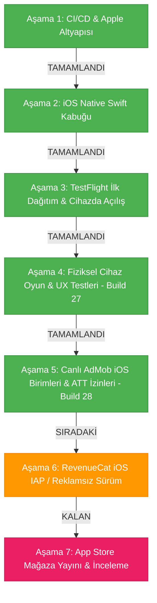

# 2 Player Snake - iOS Sürümü Yapay Zeka Rehberi

Bu belge, `2 Player Snake` projesinin iOS native hibrit uygulama katmanı için teknik referanstır. Masada fiziksel bir Mac bilgisayar olmadan, Windows ortamından bulut CI/CD (GitHub Actions + Fastlane) altyapısıyla geliştirilen ve Apple ekosistemiyle %100 uyumlu çalışan iOS kabuğunun tüm mimari detaylarını ve yol haritasını içerir.

---

## 1. Referans Durum

* **iOS Shell Kaynağı:** `d:\#3 Vibecoding\AI Games\2 Player Snake\Ana Dosya\iOS`
* **Bundle Identifier:** `com.twoplayersnake.app`
* **Apple Team ID:** `GUFQF359Q7` (Toygun ÇETİN)
* **Güncel Sürüm (Marketing Version):** `3.3.5`
* **Güncel Yapı Numarası (Build Number):** `28` (`ios-v3.3.5-b28`)
* **Derleme Ortamı:** `macos-latest` (macOS 26 Tahoe / Sonoma) + Xcode 26 + iOS SDK + CocoaPods
* **Güncel Durum:** **Aşama 5 (Canlı AdMob iOS Birimleri & ATT İzin Akışı) tamamlandı ve Build 28 olarak hazırlandı. Kullanıcının resmi AdMob iOS App ID, Geçiş ve Ödüllü reklam birimleri entegre edildi, Apple ATT izin akışı bağlandı ve CocoaPods altyapısı kuruldu.**

---

## 2. Mimari ve Bileşenler

iOS projesi, web oyun koduna (`Ana Dosya/Mobile/index.html`) dokunmadan çalışan ve Android kabuğundaki (`Ana Dosya/Android/`) tüm yetenekleri iOS donanımıyla birebir eşleyen bir Swift 5 mimarisine sahiptir:

```
Ana Dosya/iOS/
├── Podfile                            # CocoaPods bağımlılıkları (Google-Mobile-Ads-SDK)
├── TwoPlayerSnake.xcodeproj/          # Xcode Projesi ve Paylaşılan Şema
│   └── xcshareddata/xcschemes/TwoPlayerSnake.xcscheme
├── TwoPlayerSnake/
│   ├── AppDelegate.swift              # Uygulama yaşam döngüsü & Audio Session
│   ├── SceneDelegate.swift            # Pencere ve UI sahne yöneticisi
│   ├── ViewController.swift           # WKWebView, Safe-Area CSS, Splash, Offline & ATT Tetikleyici
│   ├── GameScriptMessageHandler.swift # Web <-> Swift köprü mesaj işleyicisi (adBreak)
│   ├── HapticManager.swift            # Apple Taptic Engine (UIImpactFeedbackGenerator & AudioServices)
│   ├── NetworkMonitor.swift           # NWPathMonitor ile canlı internet bağlantı takibi
│   ├── AdManager.swift                # Google AdMob SDK (Interstitial & Rewarded) & Apple ATT
│   ├── ios_bridge_bootstrap.js        # Zero-change JS köprü & 8.5s Watchdog Emniyet Simülatörü
│   ├── Info.plist                     # GADApplicationIdentifier, SKAdNetwork listesi, ATT izni
│   ├── Assets.xcassets/               # 1024x1024 App Store ikonu & renk paletleri
│   └── Base.lproj/
│       └── LaunchScreen.storyboard    # Cyberpunk saf siyah açılış ekranı
├── fastlane/
│   ├── Fastfile                       # Kendi kendini onaran CI/CD derleme & CocoaPods workspace hattı
│   └── Appfile                        # Bundle ID & Team ID konfigürasyonu
└── Gemfile                            # Fastlane bağımlılıkları
```

### Kritik Özellikler:
1. **Google Mobile Ads & ATT Entegrasyonu (`AdManager.swift` + `ViewController.swift`):**
   * Kullanıcı START butonuna basıp ana menüye indiğinde Apple'ın resmi ATT (*App Tracking Transparency*) izin diyaloğu tetiklenir.
   * `ca-app-pub-4114535776207741~3769407896` App ID'si ile Google Mobile Ads SDK başlatılır.
   * Geçiş (`6012427858`) ve Ödüllü (`7193260548`) reklamlar önden yüklenir (Preload).
   * 9 saniyelik native ve 8.5 saniyelik JS çift katmanlı Watchdog Timer sayesinde internet kopsa veya reklam gelmese bile oyun asla kilitlenmez.
2. **Sıfır Değişiklikli JS Köprüsü (`ios_bridge_bootstrap.js` + `GameScriptMessageHandler.swift`):**
   Web oyunundaki `window.Android` çağrılarını şeffaf bir şekilde yakalar ve `window.webkit.messageHandlers.iOS.postMessage(...)` üzerinden Swift'e aktarır. Böylece Android, Web ve PC sürümlerinde hiçbir kod değişikliği gerekmez.
3. **Apple Taptic Engine (`HapticManager.swift`):**
   * Normal yem yeme: Donanımsal Peek haptic (`AudioServicesPlaySystemSound(1519)`) ve `.medium` darbe geri bildirimi.
   * Özel / yıldız yem: Orta dokunsal geri bildirim (`.medium`).
   * Duvara / kuyruğa çarpma: Güçlü dokunsal geri bildirim (`.heavy`).
   * Oyun sonu: Hata bildirimi titreşimi (`UINotificationFeedbackGenerator.error`).
4. **Ekran ve Çentik Uyumu (Dynamic Island / Safe-Area):**
   `ViewController.swift`, cihazın çentik ve alt ana ekran çubuğu boşluklarını canlı olarak hesaplayarak web katmanına CSS değişkeni olarak enjekte eder (`--safe-area-top`, `--safe-area-bottom`).
5. **Kesintisiz Ağ İzleme ve Native Fallback:**
   `NetworkMonitor.swift`, `NWPathMonitor` kullanarak internet kopmalarını anında algılar. Sayfa yüklenemezse web beyaz ekranı yerine native cyberpunk temalı bir "Tekrar Dene" butonu gösterir.
6. **Kendi Kendini Onaran CI/CD Hattı (`Fastfile`):**
   * Apple Developer portalındaki 2 dağıtım sertifikası sınırını aşmak için yetim kalmış eski sertifikaları Spaceship API ile temizler.
   * `actions/cache@v4` ile `.p12` sertifikasını ve CocoaPods önbelleğini yönetir.
   * `TwoPlayerSnake.xcworkspace` üzerinden CocoaPods derlemesini otomatik yürütür.

---

## 3. Aşama Durumu (Mevcut Durum ve Kalan Adımlar)

### 📍 2. Şu An Hangi Aşamadadayız? (Yol Haritası Tablosu)

| Aşama | Başlık | Durum |
| :--- | :--- | :--- |
| **Aşama 1** | Bulut CI/CD & Apple Geliştirici Altyapısı | ✅ **Tamamlandı** |
| **Aşama 2** | iOS Native Swift Kabuğu & JS Köprü Mimarisi | ✅ **Tamamlandı** |
| **Aşama 3** | TestFlight İlk Dağıtım & Cihaza İndirme | ✅ **Tamamlandı & Doğrulandı** |
| **Aşama 4** | Fiziksel iPhone Üzerinde Oynanış & UX Testleri | ✅ **Tamamlandı (Build 27)** |
| **Aşama 5** | **Canlı AdMob iOS Birimleri & ATT İzin Akışı** | 🔄 **ŞU ANKİ AŞAMA (Tamamlandı - Build 28)** |
| **Aşama 6** | RevenueCat iOS IAP (Reklamsız Sürüm Satın Alma) | ⏳ *Sıradaki* |
| **Aşama 7** | App Store Mağaza Yayını & İnceleme Gönderimi | ⏳ *Kalan* |

---



---

### ✅ Tamamlanan Aşamalar Özeti:

#### Aşama 1: Bulut CI/CD & Apple Geliştirici Altyapısı (TAMAMLANDI)
* Apple Developer hesabı doğrulandı (`GUFQF359Q7`).
* App Store Connect API Anahtarı (`JA97H3PRT7`) ve Issuer ID yapılandırıldı.
* GitHub Secrets repo bazında bağlandı.

#### Aşama 2: iOS Native Swift Kabuğu & JS Köprü Mimarisi (TAMAMLANDI)
* Swift 5 + WKWebView native kabuk projesi oluşturuldu.
* Taptic Engine titreşim motoru, Dynamic Island safe-area enjeksiyonu, native açılış ekranı ve çevrimdışı hata yönetimi kodlandı.
* Android ve web kodunu bozmayan `ios_bridge_bootstrap.js` yazıldı.

#### Aşama 3: TestFlight İlk Dağıtım & Cihaza İndirme (TAMAMLANDI & DOĞRULANDI)
* İlk paket App Store Connect'e yüklendi, dahili test grubuna atandı ve fiziksel iPhone üzerinde indirilip açılışı başarıyla doğrulandı.

#### Aşama 4: Fiziksel iPhone Üzerinde Oynanış & UX Testleri (TAMAMLANDI - Build 27)
* Sürüm numarası Android ve Web ile eşitlenerek `3.3.5` yapıldı.
* Reklam deadlock kilitlenmeleri çözüldü.
* DOM MutationObserver ile maç içi güvenli Peek Haptic titreşimi sağlandı.
* Klavye sonrası ekran kayması ve pause menüsü ana ekran dönüşü düzeltildi.
* Kenardan kenara (edge-to-edge) cyberpunk panel tasarımı oturtuldu.

---

### 🔄 ŞU ANKİ AŞAMA (Tamamlanan / Dağıtılan):
#### Aşama 5: Canlı AdMob iOS Birimleri & ATT İzin Akışı (Build 28)
* **Canlı AdMob Kimlikleri Bağlandı:**
  * **App ID:** `ca-app-pub-4114535776207741~3769407896`
  * **Geçiş (Interstitial) ID:** `ca-app-pub-4114535776207741/6012427858`
  * **Ödüllü (Rewarded) ID:** `ca-app-pub-4114535776207741/7193260548`
* **Apple ATT İzin Diyaloğu:** Ana menüye inildiği an `ATTrackingManager.requestTrackingAuthorization` tetiklenerek kullanıcı onayı alındıktan sonra kişiselleştirilmiş reklam isteği atılması sağlandı.
* **CocoaPods & Workspace:** `Google-Mobile-Ads-SDK` iOS projesine eklendi, `Fastfile` ve GitHub Actions CI hattı workspace derlemesine uyarlandı.
* **Çift Katmanlı Watchdog (Kilitlenme Koruması):** Swift tarafında 9.0s, JS tarafında 8.5s zaman aşımı sübapları eklenerek reklam gecikmesi veya internet kopmalarında maçın asla takılmaması garanti altına alındı.

---

### ⏳ KALAN AŞAMALAR VE YAPILACAKLAR:

#### 1. Aşama 5: Canlı AdMob iOS Birimleri & ATT İzin Akışı (SIRADAKİ)
* **Amaç:** Google AdMob'un iOS tarafında aktif hale getirilmesi ve Apple'ın zorunlu kıldığı ATT (App Tracking Transparency) izin akışının sunulması.
* **Yapılacak Adımlar:**
  1. Google AdMob panelinde **"iOS - 2 Player Snake"** uygulaması tanımlanacak.
  2. iOS için geçerli Banner, Interstitial (Geçiş) ve Rewarded (Ödüllü) reklam birim kimlikleri (Ad Unit IDs) oluşturulacak.
  3. `AdManager.swift` ve `Info.plist` dosyalarındaki test birim kimlikleri, canlı AdMob kimlikleriyle değiştirilecek.
  4. iOS 14.5+ ATT (*App Tracking Transparency*) izin diyaloğu (`requestTrackingAuthorization`) test edilecek ve kullanıcı onayına göre kişiselleştirilmiş / kişiselleştirilmemiş reklam gösterimi doğrulanacak.
  5. `ios_bridge_bootstrap.js` içerisindeki geçici ad shim devre dışı bırakılarak gerçek native AdMob köprüsüne bağlanacak.

#### 2. Aşama 6: RevenueCat iOS IAP (Reklamsız Sürüm Satın Alma) (KALAN)
* **Amaç:** Apple In-App Purchase (IAP - Uygulama İçi Satın Alma) ile oyuncuların reklamları kaldırmasını sağlamak.
* **Yapılacak Adımlar:**
  1. App Store Connect üzerinde **"Remove Ads" (Reklamsız Sürüm)** adında Non-Consumable (tüketilemeyen) bir In-App Purchase öğesi tanımlanacak (örnek ürün kodu: `com.twoplayersnake.app.removeads`).
  2. RevenueCat dashboard'una Apple App Store Paylaşılan Gizli Anahtarı (StoreKit Shared Secret) / In-App Purchase API Key girilecek.
  3. Swift tarafında StoreKit / RevenueCat SDK entegrasyonu tamamlanarak köprü (`window.Android.buyRemoveAds()` & `restorePurchases()`) StoreKit ile eşleştirilecek.
  4. Apple'ın zorunlu tuttuğu "Satın Alımları Geri Yükle" (Restore Purchases) butonu ve işlevi test edilecek.

#### 3. Aşama 7: App Store Mağaza Yayını & İnceleme Gönderimi (KALAN)
* **Amaç:** Uygulamanın tüm dünyaya açılmak üzere Apple App Store onayına gönderilmesi.
* **Yapılacak Adımlar:**
  1. **Ekran Görüntüleri (Screenshots):** 6.7 inç (iPhone 15/16 Pro Max vb.) ve isteğe bağlı 12.9 inç (iPad) cihazlar için yüksek çözünürlüklü mockup görseller hazırlanacak.
  2. **Mağaza Meta Verileri:** `MD Files/Store_Listing.md` referans alınarak uygulama açıklaması, anahtar kelimeler (keywords), destek URL'si ve gizlilik politikası (Privacy Policy) URL'si girilecek.
  3. **Telif & Geliştirici Bilgileri:** Geliştirici/Organizasyon bilgileri ve Copyright metni (örn. *© 2026 RomiToy Games*) yapılandırılacak.
  4. **App Review İnceleme Notları:** Apple test uzmanları için demo giriş bilgileri ve açıklama notları girilecek.
  5. **Yayına Gönderim (Submit for Review):** Yapı seçilerek Apple inceleme kuyruğuna iletilecek.
