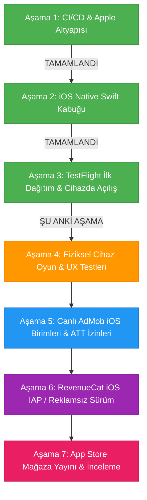

# 2 Player Snake - iOS Sürümü Yapay Zeka Rehberi

Bu belge, `2 Player Snake` projesinin iOS native hibrit uygulama katmanı için teknik referanstır. Masada fiziksel bir Mac bilgisayar olmadan, Windows ortamından bulut CI/CD (GitHub Actions + Fastlane) altyapısıyla geliştirilen ve Apple ekosistemiyle %100 uyumlu çalışan iOS kabuğunun tüm mimari detaylarını ve yol haritasını içerir.

---

## 1. Referans Durum

* **iOS Shell Kaynağı:** `d:\#3 Vibecoding\AI Games\2 Player Snake\Ana Dosya\iOS`
* **Bundle Identifier:** `com.twoplayersnake.app`
* **Apple Team ID:** `GUFQF359Q7` (Toygun ÇETİN)
* **Güncel Sürüm (Marketing Version):** `1.0.0`
* **Güncel Yapı Numarası (Build Number):** `14`
* **Derleme Ortamı:** `macos-latest` (macOS 26 Tahoe) + Xcode 26.6 + iOS 26 SDK
* **Güncel Durum:** **TestFlight'a başarıyla yüklendi, Apple tarafından işlendi (Complete), dahili test grubuna atandı ve fiziksel iPhone üzerinde indirilip açılışı doğrulandı!**

---

## 2. Mimari ve Bileşenler

iOS projesi, web oyun koduna (`Ana Dosya/Mobile/index.html`) dokunmadan çalışan ve Android kabuğundaki (`Ana Dosya/Android/`) tüm yetenekleri iOS donanımıyla birebir eşleyen bir Swift 5 mimarisine sahiptir:

```
Ana Dosya/iOS/
├── TwoPlayerSnake.xcodeproj/          # Xcode 26 Projesi ve Paylaşılan Şema
│   └── xcshareddata/xcschemes/TwoPlayerSnake.xcscheme
├── TwoPlayerSnake/
│   ├── AppDelegate.swift              # Uygulama yaşam döngüsü & AdMob başlatma
│   ├── SceneDelegate.swift            # Pencere ve UI sahne yöneticisi
│   ├── ViewController.swift           # WKWebView, Safe-Area CSS, Splash & Offline Ekranı
│   ├── GameScriptMessageHandler.swift # Web <-> Swift köprü mesaj işleyicisi
│   ├── HapticManager.swift            # Apple Taptic Engine (UIImpactFeedbackGenerator)
│   ├── NetworkMonitor.swift           # NWPathMonitor ile canlı internet bağlantı takibi
│   ├── AdManager.swift                # Google AdMob & ATT (App Tracking Transparency)
│   ├── ios_bridge_bootstrap.js        # Zero-change JS köprü simülatörü
│   ├── Info.plist                     # İzinler, SKAdNetwork, ATS ve yönelim kuralları
│   ├── Assets.xcassets/               # 1024x1024 App Store ikonu & renk paletleri
│   └── Base.lproj/
│       └── LaunchScreen.storyboard    # Cyberpunk siyah-neon açılış ekranı
├── fastlane/
│   ├── Fastfile                       # Kendi kendini onaran CI/CD derleme & dağıtım hattı
│   └── Appfile                        # Bundle ID & Team ID konfigürasyonu
└── Gemfile                            # Fastlane bağımlılıkları
```

### Kritik Özellikler:
1. **Sıfır Değişiklikli JS Köprüsü (`ios_bridge_bootstrap.js` + `GameScriptMessageHandler.swift`):**
   Web oyunundaki `window.Android` çağrılarını şeffaf bir şekilde yakalar ve `window.webkit.messageHandlers.snakeBridge.postMessage(...)` üzerinden Swift'e aktarır. Böylece Android ve Web sürümlerinde hiçbir kod değişikliği gerekmez.
2. **Apple Taptic Engine (`HapticManager.swift`):**
   * Normal yem yeme: Hafif dokunsal geri bildirim (`.light`).
   * Özel / yıldız yem: Orta dokunsal geri bildirim (`.medium`).
   * Duvara / kuyruğa çarpma: Güçlü dokunsal geri bildirim (`.heavy`).
   * Oyun sonu: Hata bildirimi titreşimi (`UINotificationFeedbackGenerator.error`).
3. **Ekran ve Çentik Uyumu (Dynamic Island / Safe-Area):**
   `ViewController.swift`, cihazın çentik ve alt ana ekran çubuğu boşluklarını canlı olarak hesaplayarak web katmanına CSS değişkeni olarak enjekte eder (`--safe-area-top`, `--safe-area-bottom`).
4. **Kesintisiz Ağ İzleme ve Native Fallback:**
   `NetworkMonitor.swift`, `NWPathMonitor` kullanarak internet kopmalarını anında algılar. Sayfa yüklenemezse web beyaz ekranı yerine native cyberpunk temalı bir "Tekrar Dene" butonu gösterir.
5. **Kendi Kendini Onaran CI/CD Hattı (`Fastfile`):**
   * Apple Developer portalındaki 2 dağıtım sertifikası sınırını aşmak için yetim kalmış eski sertifikaları Spaceship API ile temizler.
   * `actions/cache@v4` ile `.p12` sertifikasını önbelleğe alarak her çalıştırmada sıfırdan sertifika üretme ihtiyacını ortadan kaldırır.
   * macOS Sonoma ve Tahoe üzerindeki `-db` anahtarlık (keychain) uzantısı farkını otomatik yönetir.

---

## 3. Aşama Durumu (Mevcut Durum ve Kalan Adımlar)

Proje 7 ana aşamadan oluşmaktadır:



### ✅ Tamamlanan Aşamalar:
* **Aşama 1: Bulut CI/CD ve Apple Developer Altyapısı (TAMAMLANDI)**
  * Apple Developer hesabı doğrulandı (`GUFQF359Q7`).
  * App Store Connect API Anahtarı (`JA97H3PRT7`) ve Issuer ID yapılandırıldı.
  * GitHub Secrets (`APPLE_TEAM_ID`, `APP_STORE_CONNECT_KEY_ID`, `APP_STORE_CONNECT_ISSUER_ID`, `APP_STORE_CONNECT_PRIVATE_KEY`, `CI_KEYCHAIN_PASSWORD`) repo bazında bağlandı.
* **Aşama 2: iOS Native Swift Kabuğu ve Çift Yönlü Köprü (TAMAMLANDI)**
  * Swift 5 + WKWebView native kabuk projesi oluşturuldu.
  * Taptic Engine titreşim motoru, Dynamic Island safe-area enjeksiyonu, native açılış ekranı ve çevrimdışı hata yönetimi kodlandı.
  * Android ve web kodunu bozmayan `ios_bridge_bootstrap.js` yazıldı.
* **Aşama 3: TestFlight Bulut Dağıtımı ve Fiziksel Cihaz Kurulumu (TAMAMLANDI & DOĞRULANDI)**
  * `macos-latest` (Xcode 26 / iOS 26 SDK) koşucusunda otomatik derlendi.
  * Yapı 14 (Sürüm 1.0.0) başarıyla App Store Connect'e yüklendi.
  * Dahili test grubu oluşturularak geliştirici iPhone'una TestFlight üzerinden indirildi ve oyunun açıldığı teyit edildi!

---

### 🔄 ŞU ANKİ AŞAMA:
* **Aşama 4: Fiziksel Cihaz Üzerinde Oyun Deneyimi & İnce Ayarlar (Devam Ediyor)**
  * **Test Edilecek Unsurlar:**
    1. **Dokunmatik Kontroller:** Sanal joystick ve yön butonlarının iPhone ekranındaki hassasiyeti ve gecikmesizliği.
    2. **Taptic Engine (Titreşim):** Yem yendiğinde, duvara çarpıldığında veya oyun bittiğinde titreşimin doğru şiddette gelip gelmediği.
    3. **Sesler & Müzik:** iOS donanımında WebAudio / arka plan müziklerinin sessiz mod anahtarından (mute switch) nasıl etkilendiği.
    4. **Ekran & Çentik Oranı:** Çentik (veya Dynamic Island) ve alt çizginin oyun butonlarını örtüp örtmediği.
    5. **Performans (FPS):** 60/120 FPS akıcılık durumu ve ısınma/pil tüketimi.

---

### ⏳ KALAN AŞAMALAR:
* **Aşama 5: Canlı AdMob iOS Birimleri & ATT İzin Akışı**
  * Google AdMob panelinde **"iOS - 2 Player Snake"** uygulaması tanımlanacak.
  * iOS için Banner, Interstitial (Geçiş) ve Rewarded (Ödüllü) reklam birimleri üretilecek.
  * `AdManager.swift` ve `Info.plist` dosyalarındaki test birim kimlikleri gerçek iOS birimleriyle güncellenecek.
  * iOS 14.5+ ATT (*App Tracking Transparency*) izin diyaloğu test edilecek.
* **Aşama 6: In-App Purchase (IAP) & RevenueCat iOS Entegrasyonu**
  * App Store Connect üzerinde **"Remove Ads" (Reklamları Kaldır)** Non-Consumable (tüketilemeyen) uygulama içi satın alma öğesi açılacak.
  * RevenueCat projesine Apple StoreKit paylaşılan gizli anahtarı / API anahtarı eklenecek.
  * Android'de olduğu gibi iOS'ta da reklamsız sürüm satın alma ve "Satın Alımları Geri Yükle" (Restore Purchases) akışı native köprüye bağlanacak.
* **Aşama 7: App Store Mağaza Yayını (Public Store Submission)**
  * 6.7 inç (iPhone) ve 12.9 inç (iPad) ekran görüntüleri (mockup'lar) hazırlanacak.
  * App Store mağaza metinleri, anahtar kelimeler (keywords), gizlilik politikası URL'si (`Store_Listing.md` referansıyla) girilecek.
  * Apple App Review (İnceleme Ekibi) için test notları hazırlanacak ve genel dağıtıma ("Submit for Review") gönderilecek.
