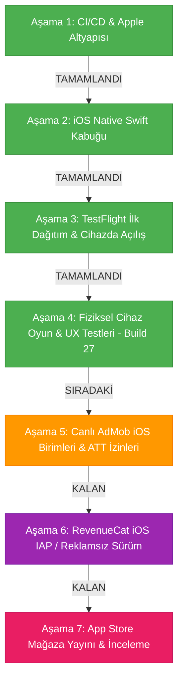

# 2 Player Snake - iOS Sürümü Yapay Zeka Rehberi

Bu belge, `2 Player Snake` projesinin iOS native hibrit uygulama katmanı için teknik referanstır. Masada fiziksel bir Mac bilgisayar olmadan, Windows ortamından bulut CI/CD (GitHub Actions + Fastlane) altyapısıyla geliştirilen ve Apple ekosistemiyle %100 uyumlu çalışan iOS kabuğunun tüm mimari detaylarını ve yol haritasını içerir.

---

## 1. Referans Durum

* **iOS Shell Kaynağı:** `d:\#3 Vibecoding\AI Games\2 Player Snake\Ana Dosya\iOS`
* **Bundle Identifier:** `com.twoplayersnake.app`
* **Apple Team ID:** `GUFQF359Q7` (Toygun ÇETİN)
* **Güncel Sürüm (Marketing Version):** `3.3.5`
* **Güncel Yapı Numarası (Build Number):** `27` (`ios-v3.3.5-b27`)
* **Derleme Ortamı:** `macos-latest` (macOS 26 Tahoe / Sonoma) + Xcode 26 + iOS SDK
* **Güncel Durum:** **Aşama 4 (Fiziksel iPhone Üzerinde Oynanış & UX Testleri) Build 27 ile tamamlanma/dondurulma noktasına getirildi. TestFlight üzerinde v3.3.5 sürüm paritesi sağlandı, maç başlangıç kilidi kaldırıldı, güvenli yem haptic titreşimleri ve klavye/pause düzeltmeleri uygulandı.**

---

## 2. Mimari ve Bileşenler

iOS projesi, web oyun koduna (`Ana Dosya/Mobile/index.html`) dokunmadan çalışan ve Android kabuğundaki (`Ana Dosya/Android/`) tüm yetenekleri iOS donanımıyla birebir eşleyen bir Swift 5 mimarisine sahiptir:

```
Ana Dosya/iOS/
├── TwoPlayerSnake.xcodeproj/          # Xcode Projesi ve Paylaşılan Şema
│   └── xcshareddata/xcschemes/TwoPlayerSnake.xcscheme
├── TwoPlayerSnake/
│   ├── AppDelegate.swift              # Uygulama yaşam döngüsü & AdMob başlatma
│   ├── SceneDelegate.swift            # Pencere ve UI sahne yöneticisi
│   ├── ViewController.swift           # WKWebView, Safe-Area CSS, Splash & Offline Ekranı
│   ├── GameScriptMessageHandler.swift # Web <-> Swift köprü mesaj işleyicisi
│   ├── HapticManager.swift            # Apple Taptic Engine (UIImpactFeedbackGenerator & AudioServices)
│   ├── NetworkMonitor.swift           # NWPathMonitor ile canlı internet bağlantı takibi
│   ├── AdManager.swift                # Google AdMob & ATT (App Tracking Transparency)
│   ├── ios_bridge_bootstrap.js        # Zero-change JS köprü & DOM MutationObserver simülatörü
│   ├── Info.plist                     # İzinler, SKAdNetwork, ATS ve yönelim kuralları
│   ├── Assets.xcassets/               # 1024x1024 App Store ikonu & renk paletleri
│   └── Base.lproj/
│       └── LaunchScreen.storyboard    # Cyberpunk saf siyah açılış ekranı
├── fastlane/
│   ├── Fastfile                       # Kendi kendini onaran CI/CD derleme & dağıtım hattı
│   └── Appfile                        # Bundle ID & Team ID konfigürasyonu
└── Gemfile                            # Fastlane bağımlılıkları
```

### Kritik Özellikler:
1. **Sıfır Değişiklikli JS Köprüsü (`ios_bridge_bootstrap.js` + `GameScriptMessageHandler.swift`):**
   Web oyunundaki `window.Android` çağrılarını şeffaf bir şekilde yakalar ve `window.webkit.messageHandlers.snakeBridge.postMessage(...)` üzerinden Swift'e aktarır. Böylece Android, Web ve PC sürümlerinde hiçbir kod değişikliği gerekmez.
2. **Apple Taptic Engine (`HapticManager.swift`):**
   * Normal yem yeme: Donanımsal Peek haptic (`AudioServicesPlaySystemSound(1519)`) ve `.medium` darbe geri bildirimi.
   * Özel / yıldız yem: Orta dokunsal geri bildirim (`.medium`).
   * Duvara / kuyruğa çarpma: Güçlü dokunsal geri bildirim (`.heavy`).
   * Oyun sonu: Hata bildirimi titreşimi (`UINotificationFeedbackGenerator.error`).
3. **Ekran ve Çentik Uyumu (Dynamic Island / Safe-Area):**
   `ViewController.swift`, cihazın çentik ve alt ana ekran çubuğu boşluklarını canlı olarak hesaplayarak web katmanına CSS değişkeni olarak enjekte eder (`--safe-area-top`, `--safe-area-bottom`).
4. **Kesintisiz Ağ İzleme ve Native Fallback:**
   `NetworkMonitor.swift`, `NWPathMonitor` kullanarak internet kopmalarını anında algılar. Sayfa yüklenemezse web beyaz ekranı yerine native cyberpunk temalı bir "Tekrar Dene" butonu gösterir.
5. **Kendi Kendini Onaran CI/CD Hattı (`Fastfile`):**
   * Apple Developer portalındaki 2 dağıtım sertifikası sınırını aşmak için yetim kalmış eski sertifikaları Spaceship API ile temizler.
   * `actions/cache@v4` ile `.p12` sertifikasını önbelleğe alarak her çalıştırmada sıfırdan sertifika üretme ihtiyacını ortadan kaldırır.
   * macOS Sonoma ve Tahoe üzerindeki `-db` anahtarlık (keychain) uzantısı farkını otomatik yönetir.

---

## 3. Aşama Durumu (Mevcut Durum ve Kalan Adımlar)

### 📍 2. Şu An Hangi Aşamadadayız? (Yol Haritası Tablosu)

| Aşama | Başlık | Durum |
| :--- | :--- | :--- |
| **Aşama 1** | Bulut CI/CD & Apple Geliştirici Altyapısı | ✅ **Tamamlandı** |
| **Aşama 2** | iOS Native Swift Kabuğu & JS Köprü Mimarisi | ✅ **Tamamlandı** |
| **Aşama 3** | TestFlight İlk Dağıtım & Cihaza İndirme | ✅ **Tamamlandı & Doğrulandı** |
| **Aşama 4** | **Fiziksel iPhone Üzerinde Oynanış & UX Testleri** | 🔄 **ŞU ANKİ AŞAMA (Tamamlandı / Donduruldu)** |
| **Aşama 5** | Canlı AdMob iOS Birimleri & ATT İzin Akışı | ⏳ *Sıradaki* |
| **Aşama 6** | RevenueCat iOS IAP (Reklamsız Sürüm Satın Alma) | ⏳ *Kalan* |
| **Aşama 7** | App Store Mağaza Yayını & İnceleme Gönderimi | ⏳ *Kalan* |

---



---

### ✅ Tamamlanan Aşamalar Özeti:

#### Aşama 1: Bulut CI/CD & Apple Geliştirici Altyapısı (TAMAMLANDI)
* Apple Developer hesabı doğrulandı (`GUFQF359Q7`).
* App Store Connect API Anahtarı (`JA97H3PRT7`) ve Issuer ID yapılandırıldı.
* GitHub Secrets (`APPLE_TEAM_ID`, `APP_STORE_CONNECT_KEY_ID`, `APP_STORE_CONNECT_ISSUER_ID`, `APP_STORE_CONNECT_PRIVATE_KEY`, `CI_KEYCHAIN_PASSWORD`) repo bazında bağlandı.

#### Aşama 2: iOS Native Swift Kabuğu & JS Köprü Mimarisi (TAMAMLANDI)
* Swift 5 + WKWebView native kabuk projesi oluşturuldu.
* Taptic Engine titreşim motoru, Dynamic Island safe-area enjeksiyonu, native açılış ekranı ve çevrimdışı hata yönetimi kodlandı.
* Android ve web kodunu bozmayan `ios_bridge_bootstrap.js` yazıldı.

#### Aşama 3: TestFlight İlk Dağıtım & Cihaza İndirme (TAMAMLANDI & DOĞRULANDI)
* `macos-latest` (Xcode / iOS SDK) koşucusunda otomatik derlendi.
* İlk paket App Store Connect'e yüklendi, dahili test grubuna atandı ve fiziksel iPhone üzerinde indirilip açılışı başarıyla doğrulandı.

---

### 🔄 ŞU ANKİ AŞAMA (Dondurulan / Tamamlanan Aşama):
#### Aşama 4: Fiziksel iPhone Üzerinde Oynanış & UX Testleri (Build 14 -> Build 27)
*Kullanıcı geri bildirimleri doğrultusunda fiziksel cihazda tespit edilen tüm kritik problemler çözülmüş ve Aşama 5'e geçiş öncesi kararlı hale getirilmiştir:*
1. **Sürüm Paritesi (v3.3.5):** TestFlight'ta `1.0.0` olarak görünen pazarlama sürümü, Android ve Web referansıyla eşitlenerek `3.3.5` yapıldı.
2. **Maç Başlatma Kilitlenmesi Çözümü (Build 27):** Web motorunun reklam servisini bekleyip deadlock'a girmesi engellendi. `__nativeAdBreakShim` anında ve senkron olarak `beforeAd`, `afterAd`, `adBreakDone` fonksiyonlarını tetikleyecek şekilde düzenlendi; `adInProgress = false` ve `isAdsRemoved = "true"` yapılarak `START` ve `qs-start` butonlarının anında maçı başlatması garanti altına alındı.
3. **Güvenli Yem Haptic Titreşimi:** Web AudioContext prototype yamalarının yarattığı ses/motor çakışmaları tamamen temizlendi. Yerine `#p1PanelLen` ve `#p2PanelLen` DOM uzunluklarını izleyen non-invasive `MutationObserver` (ve `requestAnimationFrame` emniyet kontrolü) kuruldu. Yalnızca aktif maç esnasında skor arttığında `AudioServicesPlaySystemSound(1519)` (Peek Haptic) ve `.medium` darbe motoru tetiklendi.
4. **Klavye Sonrası Ekranın Yukarıda Kalması:** İsim giriş alanlarından çıkıldığında (`blur`), iOS WebView'ın kaydırılmış kalmasını önlemek için `window.scrollTo(0, 0)` ve `visualViewport` düzeltmesi uygulandı.
5. **Pause Menüsünden Ana Menüye Dönüş:** Duraklatma modalındaki "Ana Menü" butonuna basıldığında event bubbling ve oyun döngüsü kilitlenmeleri çözüldü; doğrudan ana menü görünümüne sıfırlama sağlandı.
6. **Start Ekranı ve Glass Panel Paritesi:** Android sürümüyle birebir uyumlu neon Start ekranı, çentik ve alt siyah boşluksuz (edge-to-edge) yerleşim ve cyberpunk buzlu cam (glassmorphism) panel stilleri entegre edildi.
7. **Karar:** Kullanıcı isteği üzerine ("Tamam şimdilik böyle kalsın. İyileştirmeleri daha sonra yaparız.") Aşama 4 bu noktada dondurulmuştur.

---

### ⏳ KALAN AŞAMALAR VE YAPILACAKLAR:

#### 1. Aşama 5: Canlı AdMob iOS Birimleri & ATT İzin Akışı (SIRADAKİ)
* **Amaç:** Google AdMob'un iOS tarafında aktif hale getirilmesi ve Apple'ın zorunlu kıldığı ATT (App Tracking Transparency) izin akışının sunulması.
* **Yapılacak Adımlar:**
  1. Google AdMob panelinde **"iOS - 2 Player Snake"** uygulaması tanımlanacak.
  2. iOS için geçerli Banner, Interstitial (Geçiş) ve Rewarded (Ödüllü) reklam birim kimlikleri (Ad Unit IDs) oluşturulacak.
  3. `AdManager.swift` ve `Info.plist` dosyalarındaki test birim kimlikleri, canlı AdMob kimlikleriyle değiştirilecek.
  4. iOS 14.5+ ATT (*App Tracking Transparency*) izin diyaloğu (`requestTrackingAuthorization`) test edilecek ve kullanıcı onayına göre kişiselleştirilmiş / kişiselleştirilmemiş reklam gösterimi doğrulanacak.
  5. `ios_bridge_bootstrap.js` içerisindeki geçici ad shim devre dışı bırakılarak gerçek native AdMob köprüsüne bağlanacak.

#### 2. Aşama 6: RevenueCat iOS IAP (Reklamsız Sürüm Satın Alma) (KALAN)
* **Amaç:** Apple In-App Purchase (IAP - Uygulama İçi Satın Alma) ile oyuncuların reklamları kaldırmasını sağlamak.
* **Yapılacak Adımlar:**
  1. App Store Connect üzerinde **"Remove Ads" (Reklamsız Sürüm)** adında Non-Consumable (tüketilemeyen) bir In-App Purchase öğesi tanımlanacak (örnek ürün kodu: `com.twoplayersnake.app.removeads`).
  2. RevenueCat dashboard'una Apple App Store Paylaşılan Gizli Anahtarı (StoreKit Shared Secret) / In-App Purchase API Key girilecek.
  3. Swift tarafında StoreKit / RevenueCat SDK entegrasyonu tamamlanarak köprü (`window.Android.buyRemoveAds()` & `restorePurchases()`) StoreKit ile eşleştirilecek.
  4. Apple'ın zorunlu tuttuğu "Satın Alımları Geri Yükle" (Restore Purchases) butonu ve işlevi test edilecek.

#### 3. Aşama 7: App Store Mağaza Yayını & İnceleme Gönderimi (KALAN)
* **Amaç:** Uygulamanın tüm dünyaya açılmak üzere Apple App Store onayına gönderilmesi.
* **Yapılacak Adımlar:**
  1. **Ekran Görüntüleri (Screenshots):** 6.7 inç (iPhone 15/16 Pro Max vb.) ve isteğe bağlı 12.9 inç (iPad) cihazlar için yüksek çözünürlüklü mockup görseller hazırlanacak.
  2. **Mağaza Meta Verileri:** `MD Files/Store_Listing.md` referans alınarak uygulama açıklaması, anahtar kelimeler (keywords), destek URL'si ve gizlilik politikası (Privacy Policy) URL'si girilecek.
  3. **Telif & Geliştirici Bilgileri:** Geliştirici/Organizasyon bilgileri ve Copyright metni (örn. *© 2026 RomiToy Games*) yapılandırılacak.
  4. **App Review İnceleme Notları:** Apple test uzmanları için demo giriş bilgileri ve açıklama notları girilecek.
  5. **Yayına Gönderim (Submit for Review):** Yapı seçilerek Apple inceleme kuyruğuna iletilecek.
